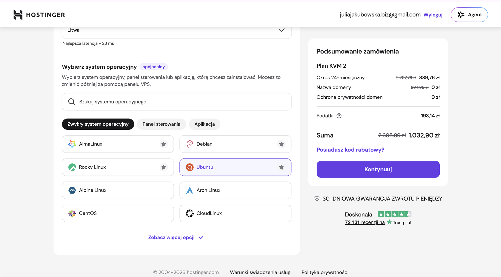
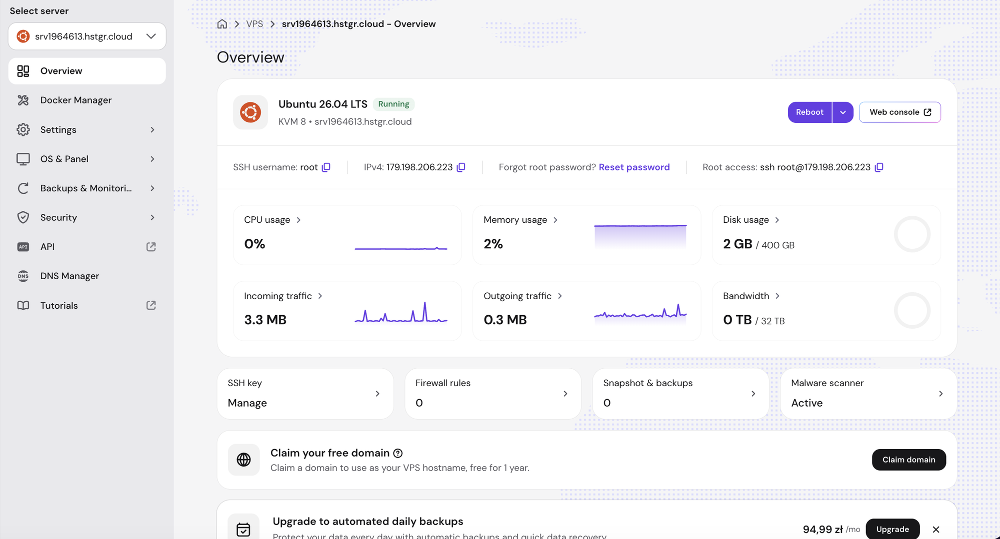
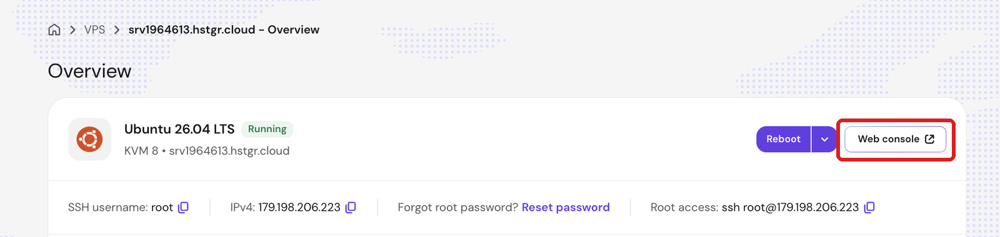
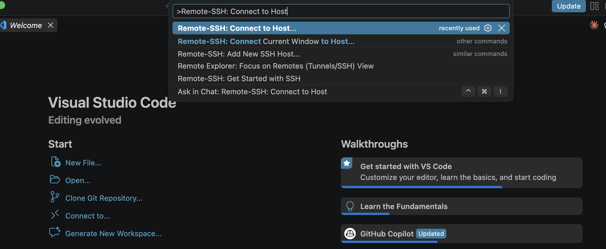

# Konfiguracja serwera VPS

Zabezpiecz świeży serwer VPS w kwadrans - robi to agent, Ty tylko odpowiadasz na pytania. Potem wpinasz się na serwer z terminala, z VS Code, z aplikacji Claude Code albo Codex - jednym słowem zamiast całej komendy.

Świeży VPS dostaje pierwsze pukanie od botów kilka minut po starcie. Domyślnie wchodzi się na niego hasłem, jako root, przez otwarty na cały świat port. Po tej instrukcji: logowanie tylko kluczem, root zablokowany, zapora przepuszcza tylko to, co trzeba, a próby zgadywania hasła kończą się banem.

- ⏱ ok. 15 minut
- 🧑‍💻 zero programowania - agent wykonuje komendy, Ty potwierdzasz (i raz podajesz hasło, jeśli klucz nie jest jeszcze na serwerze)
- 💻 Claude Code albo Codex na komputerze z macOS, Linuksem albo Windowsem
- 📄 `PROMPT.md` - instrukcja, którą dostaje agent · `audit.sh` - sprawdzenie przed i po

---

## Czego potrzebujesz

**Serwer VPS z Ubuntu 22.04, 24.04 lub 26.04.** Może być świeżo postawiony - tak jest nawet lepiej. Ja używam Hostingera: [hostinger.com/julia10](https://www.hostinger.com/julia10), kod **JULIA10** daje dodatkowy rabat. Przy zamawianiu, w kroku „Wybierz system operacyjny", wystarczy kliknąć **Ubuntu** - nic więcej:



**Dane serwera z hPanelu:** VPS → **Manage** → zakładka **Overview**. W pasku pod nazwą serwera masz wszystko: `SSH username` (root), `IPv4` (ikonka obok kopiuje adres) i pod `Root access` gotową komendę SSH. Hasło to to, które ustawiałaś przy tworzeniu serwera - panel go nie pokaże; jeśli nie pamiętasz, kliknij **Reset password** i ustaw nowe. Hasło podasz agentowi raz - i tylko wtedy, gdy Twojego klucza nie ma jeszcze na serwerze.



---

## Jak zacząć - jeden krok

Otwórz Claude Code albo Codex (terminal albo aplikacja, w pustym folderze) i wklej ten prompt. Agent sam pobierze instrukcję z tego repozytorium i poprowadzi Cię dalej:

```text
Sklonuj repozytorium https://github.com/juliajakubowskabiznes/konfiguracja-serwera-vps.git
do bieżącego katalogu, przeczytaj plik PROMPT.md i przeprowadź mnie przez opisane tam
zabezpieczenie serwera VPS - dokładnie według jego zasad i kolejności faz. Idź krok po kroku:
wykonuj każdą komendę osobno, czekaj na wynik i nie przechodź dalej, jeśli test fazy nie
przeszedł. Zacznij od pytania o dane serwera (Faza 0). Przez cały czas pilnuj, żebym nie
straciła dostępu do serwera.
```

Agent zapyta o IP, port, login i nazwę nowego użytkownika. Odpowiadasz normalnie, po ludzku. O hasło roota zapyta tylko wtedy, gdy Twój klucz nie jest jeszcze na serwerze.

## Co się będzie działo

| Faza | Co robi agent | Gdzie masz coś do powiedzenia |
|---|---|---|
| 0 | pyta o dane serwera | podajesz IP, port, login (root) i nazwę nowego użytkownika |
| 1 | sprawdza Twój klucz SSH - jak go nie ma, generuje; jak nie ma go na serwerze, wgrywa | podajesz hasło roota - tylko jeśli klucza nie było na serwerze (albo wklejasz klucz w hPanelu i hasła nie podajesz wcale) |
| 2 | sprawdza wersję Ubuntu, robi **audyt PRZED** (lista czerwonych), aktualizuje system | jeśli system prosi o restart, agent powie - Ty decydujesz kiedy |
| 3 | tworzy nowego użytkownika z sudo, **testuje w nowym połączeniu**, dopiero potem blokuje roota i hasło - i sprawdza, że oba faktycznie odbijają | - |
| 4 | włącza zaporę (SSH, 80, 443) | - |
| 5 | fail2ban z wyjątkiem dla Twojego adresu | potwierdzasz, że pokazany adres to Twój |
| 6 | automatyczne łatki bezpieczeństwa, bez auto-restartu | - |
| 7 | skrót `ssh nazwa` na Twoim komputerze | wybierasz nazwę skrótu |
| 8 | testy końcowe + **audyt PO** (czerwone → zielone) | jeśli podawałaś hasło roota agentowi - resetujesz je w hPanelu (przez SSH już nie działa, ale w Web console tak, a leży w zapisie rozmowy); jeśli system prosił o restart - zgadzasz się na niego |

Przy każdej ryzykownej zmianie agent zatrzymuje się i testuje. Jeśli coś się wysypie - nie brnie dalej, pokazuje błąd i czeka na Ciebie.

---

## Jak poznasz, że zadziałało

Agent na koniec sam odpala testy i **audyt** (`audit.sh` z tego repozytorium) i pokazuje Ci zestawienie przed → po. Na starcie wygląda to mniej więcej tak:

```text
━━━ 1. Użytkownik zamiast roota ━━━
  [FAIL]  Brak użytkownika z sudo - logujesz się jako root
━━━ 2. SSH ━━━
  [FAIL]  Root może logować się przez SSH (permitrootlogin: yes)
  [FAIL]  Logowanie hasłem włączone
━━━ 3. Zapora (UFW) ━━━
  [FAIL]  UFW nie zainstalowany
━━━ 4. Fail2ban ━━━
  [FAIL]  Fail2ban nie zainstalowany
```

a na końcu te same pozycje na `[PASS]` i `FAIL: 0`. Wtedy agent pisze wprost: **„Serwer jest zabezpieczony"**. Jeśli coś się nie zgadza - nie brnie dalej, tylko pokazuje co i wraca do właściwej fazy.

Jedyna rzecz, którą robisz sama, bo agent nie ma dostępu do panelu: **reset hasła roota** w hPanelu (VPS → Overview → **Reset password**). Jeśli podawałaś hasło agentowi, to nie jest opcja - hasło zostało w zapisie rozmowy, a w Web console nadal działa. Reset je unieważnia.

---

## Słowniczek - co agent ustawił i po co

**Klucz SSH zamiast hasła.** Klucz to para plików: prywatny zostaje na Twoim komputerze (`~/.ssh/id_ed25519`), publiczny idzie na serwer. Serwer wpuszcza tylko tego, kto ma pasujący prywatny. Hasła da się zgadywać - klucza nie. Klucz jest bez hasła, żeby aplikacje (Claude Code, Codex, VS Code) łączyły się bez dodatkowego pytania. **Konsekwencja:** ten jeden plik to pełny dostęp do serwera - kto go ma, ten ma roota. Nigdzie go nie wklejasz, nie wysyłasz, nie trzymasz w chmurze; a Twój komputer ma mieć zaszyfrowany dysk i blokadę ekranu.

**Dlaczego na końcu resetujesz hasło roota.** Claude Code i Codex zapisują całą rozmowę razem z komendami na dysku. Jeśli agent wgrywał Twój klucz na serwer, hasło roota przeszło przez tę rozmowę - więc po hardeningu je unieważniasz. Można to w ogóle ominąć: przy tworzeniu VPS-a (albo później: VPS → Settings → SSH keys) wklej swój publiczny klucz - agent wykryje, że działa, i o hasło nie zapyta.

**Web console w hPanelu.** Twój VPS to maszyna wirtualna, a Web console to jej ekran i klawiatura przekazane do przeglądarki - jakbyś siedziała przy serwerze fizycznie. Nie idzie przez sieć, więc SSH, zapora i fail2ban jej nie dotyczą; logujesz się tam jak na ekranie startowym systemu, hasłem roota. Dlatego to Twoje wejście awaryjne, gdy coś zepsujesz - i dlatego hasło do konta Hostingera to klucz do wszystkiego.



**Nowy użytkownik zamiast roota.** Root może wszystko, jedna zła komenda i serwer leży. Zwykły użytkownik z `sudo` musi wprost poprosić o uprawnienia (`sudo` przed komendą). `NOPASSWD` znaczy, że `sudo` nie pyta o hasło - bo konto i tak nie ma hasła, logujesz się kluczem.

**`PermitRootLogin no`.** Root nie może logować się przez SSH. Nadal istnieje, dostajesz się do niego przez `sudo` - ale z zewnątrz nikt nie zgadnie „root + hasło". Klucz roota zostaje na serwerze w `/root/.ssh/authorized_keys` - jest bezczynny (root i tak nie wchodzi), a przydaje się przy ratowaniu przez Web console.

**`PasswordAuthentication no`, `PermitEmptyPasswords no`.** Logowanie hasłem wyłączone, puste hasło też. Zostaje klucz. To jedna zmiana, która eliminuje większość ataków na serwer.

**`MaxAuthTries 3`, `LoginGraceTime 30`.** Trzy nieudane próby i połączenie zerwane; 30 sekund na zalogowanie, potem koniec. Boty dostają mniej czasu na próby. Dlatego skrót w `~/.ssh/config` ma `IdentitiesOnly yes` - bez tego SSH próbowałby po kolei wszystkich Twoich kluczy i przy kilku kluczach wyczerpałby limit, zanim doszedłby do właściwego.

**`ClientAliveInterval 300`, `ClientAliveCountMax 2`.** Sesja, która milczy dłużej niż ~10 minut (np. uśpiony laptop), jest zrywana. Dlatego w gołym terminalu odpalaj agenta w `tmux` (niżej) - aplikacje Claude Code i VS Code same wznawiają połączenie.

**Zapora (UFW).** Domyślnie **nic** nie wchodzi z zewnątrz. Wyjątki: SSH (żebyś Ty weszła), 80 i 443 (żeby działała strona lub aplikacja, jeśli jakąś postawisz). Kolejność ma znaczenie: agent najpierw dodaje wyjątek dla SSH, potem włącza zaporę. Odwrotnie zamknęłabyś sobie drzwi.

**Fail2ban.** Bramkarz od liczenia prób. Pięć nieudanych logowań z jednego adresu w ciągu 10 minut = ban na godzinę. Twój adres jest na liście wyjątków (`ignoreip`) - inaczej testy z fazy 3 („czy root już odbija?") policzyłby jako atak i zbanował Cię zaraz po instalacji. `backend = systemd` jest konieczny na Ubuntu 24.04, bo nie ma tam już pliku `/var/log/auth.log`.

**Automatyczne aktualizacje (`unattended-upgrades`).** Ubuntu co kilka dni wydaje łatki bezpieczeństwa. System instaluje je sam, po cichu - tylko łatki, nie nowe wersje programów. Bez automatycznego restartu: gdy jądro będzie go wymagać, restart robisz sama, kiedy Ci pasuje (`ssh vps "sudo reboot"`).

**Skrót w `~/.ssh/config`.** Zamiast `ssh -p 22 -i ~/.ssh/id_ed25519 julia@11.22.33.44` wpisujesz `ssh vps`. Działa jak kontakt w telefonie. Ten sam skrót czytają terminal, VS Code, aplikacja Claude Code i Codex - robisz raz, działa wszędzie. Agent wstawia go na **początek** pliku, bo w tym pliku wygrywa pierwsze wystąpienie ustawienia - gdybyś miała niżej ogólny blok `Host *`, wpis dopisany na końcu by z nim przegrał.

**Czego ta instrukcja nie robi.** Hostinger ma w hPanelu własną zaporę (VPS → Firewall), niezależną od UFW - jeśli ją włączysz, też musi przepuszczać SSH. I uwaga na przyszłość: kontenery Dockera z opcją `-p` **omijają UFW** i wystawiają port do internetu mimo zapory - o tym w osobnej instrukcji o Dockerze.

---

## Wpięcie się na serwer - trzy drogi

Wszystkie korzystają ze skrótu, który agent zrobił w Fazie 7. W przykładach nazywa się `vps` - podmień na swój.

### 1. Terminal w VS Code (Remote-SSH)

1. W VS Code zainstaluj rozszerzenie **Remote - SSH** (Microsoft).
2. `Cmd+Shift+P` (Windows: `Ctrl+Shift+P`), zacznij pisać `Remote-SSH` i wybierz **Remote-SSH: Connect to Host...** → na liście widzisz `vps`, bo wtyczka czyta ten sam `~/.ssh/config`.

   
3. Otwiera się nowe okno VS Code połączone z serwerem. Przy pierwszym połączeniu VS Code sam instaluje na serwerze swój mały „VS Code Server" (w katalogu domowym użytkownika, bez roota).
4. **File → Open Folder** - wybierasz folder **na serwerze**, np. `/home/twoj-user`.
5. **Terminal → New Terminal** - terminal otwiera się **na serwerze**, nie na Twoim komputerze. W nim uruchamiasz `claude`, `codex` czy cokolwiek.

Najlepsze do większego grzebania w plikach: drzewo katalogów, edytor, terminal - wszystko w jednym oknie, wszystko na serwerze.

### 2. Aplikacja Claude Code

1. Przy polu do wpisywania promptu rozwiń menu środowiska (to, w którym są **Local** i **Cloud**).
2. Wybierz **+ Add SSH connection**.
3. Wypełnij **jedno** pole:

| Pole | Co wpisać |
|---|---|
| Name | dowolna etykieta, np. `Mój VPS` |
| **SSH Host** | **`vps`** - sam skrót |
| SSH Port | zostaw puste - weźmie z `~/.ssh/config` |
| Identity File | zostaw puste - też z configu |

4. **Test connection**, potem **Add SSH connection**.
5. Wybierz połączenie z listy i zacznij sesję.

**Przy pierwszym połączeniu aplikacja sama instaluje Claude Code na serwerze** - nic nie stawiasz ręcznie. Logowanie idzie przez aplikację na Twoim komputerze, serwer nie potrzebuje przeglądarki.

Czego się spodziewać:
- panel plików po lewej to **serwer**, nie Twój dysk - klikasz, edytujesz, zapisujesz, zostaje tam
- wbudowany terminal aplikacji działa **tylko w sesjach lokalnych** - w sesji SSH go nie ma
- skille z `~/.claude/skills/` aplikacja czyta z katalogu domowego **na serwerze**, nie z Twojego komputera


### 3. Aplikacja Codex

Różnica względem Claude Code: aplikacja Codex **nie instaluje się sama na serwerze**. Zanim się połączysz, `codex` musi już tam być i być zalogowany. To trzy rzeczy na serwerze i cztery kliknięcia w aplikacji.

**Część A - na serwerze.** Najprościej: wklej to swojemu agentowi (Claude Code albo Codex w sesji lokalnej), podmieniając `vps` na swój skrót:

```text
Na serwerze, do którego łączę się skrótem "vps" (ssh vps), zainstaluj Codex CLI:
1. Uruchom przez ssh: curl -fsSL https://chatgpt.com/codex/install.sh | sh
2. Sprawdź w powłoce logowania: ssh vps "bash -lc 'codex --version'" - ma wypisać numer wersji.
   Jeśli "command not found": ssh vps "sudo ln -sf ~/.local/bin/codex /usr/local/bin/codex" i sprawdź ponownie.
3. Uruchom logowanie: ssh -t vps "codex login --device-auth" i pokaż mi link oraz kod, które wypisze.
   Czekaj, aż potwierdzę, że zalogowałam się w przeglądarce. Nie kopiuj żadnych plików z tokenami.
4. Sprawdź: ssh vps "bash -lc 'codex login status'" i pokaż wynik.
```

Wolisz sama? Te same kroki ręcznie, po `ssh vps`:

```bash
curl -fsSL https://chatgpt.com/codex/install.sh | sh
```

```bash
codex --version
```

Ma wypisać numer wersji. Jeśli `command not found`, wyloguj się i zaloguj ponownie (`exit`, `ssh vps`) - instalator dopisał ścieżkę, ale obecna sesja jej jeszcze nie widzi.

```bash
codex login --device-auth
```

Wypisze link i kod. Otwórz link **na swoim komputerze**, zaloguj się do ChatGPT, wpisz kod. Serwer nie potrzebuje przeglądarki.

> Jeśli zobaczysz, że logowanie kodem jest wyłączone: w ChatGPT na komputerze wejdź w ustawienia bezpieczeństwa i włącz **device code login** (na koncie firmowym robi to administrator). Potem powtórz komendę.

```bash
codex login status
```

Ma potwierdzić, że jesteś zalogowana.

**Część B - w aplikacji Codex na komputerze:**

1. **Settings → Connections**.
2. W sekcji **SSH** kliknij **Add**.
3. Wpisz nazwę skrótu: `vps` - dokładnie tę, którą zrobił agent w `~/.ssh/config`. Codex rozwiązuje ją przez OpenSSH z tego samego pliku, co terminal i VS Code. Wzorce typu `Host *` ignoruje - musi być konkretna nazwa.
4. Wybierz połączenie i wskaż folder projektu **na serwerze** (np. `/home/twoj-user`).

Aplikacja uruchamia `codex` na serwerze przez Twoją powłokę logowania - dlatego test `codex --version` z części A robisz właśnie w niej. Kolejne sesje to tylko punkt 4.


---

## Dodatek: tmux - gdy pracujesz w gołym terminalu

Dotyczy **tylko drogi 1** (terminal). W aplikacjach Claude Code i Codex sesją zarządza aplikacja - tam tego nie potrzebujesz.

**Problem:** odpalasz `claude` przez `ssh vps`, dajesz mu zadanie na 20 minut, zamykasz laptopa. Połączenie pada, a razem z nim agent - w połowie roboty.

**Rozwiązanie:** `tmux` to „biurko" na serwerze, które zostaje włączone, gdy Ty wychodzisz. Agent pracuje w nim dalej, Ty wracasz i widzisz wynik.

| Krok | Komenda |
|---|---|
| Zaloguj się i otwórz biurko | `ssh vps` → `tmux new -s praca` |
| Odpal agenta w środku | `claude` |
| Wyjdź, zostawiając biurko włączone | `Ctrl+B`, potem `D` |
| Wróć później | `ssh vps` → `tmux attach -t praca` |

Jeśli `tmux` odpowie „command not found": `sudo apt install -y tmux`.

---

## Co dalej

Serwer jest zabezpieczony, ale pusty. Każda usługa, którą na nim postawisz, to nowe drzwi - i każda ma osobną instrukcję. W kolejności:

**Tailscale** - prywatna sieć między Twoim komputerem, telefonem i serwerem. Wszystko, co ma być tylko dla Ciebie (pamięć agenta, bazy, panele), widzisz z Maca i telefonu, a internet nie widzi nic. Po niej port SSH można zamknąć całkowicie.

**Docker** - większość rzeczy, które postawisz na serwerze (agent, pamięć, n8n, bazy), działa w kontenerach Dockera. Nie stawiasz nic? Nie instalujesz Dockera i ten punkt Cię nie dotyczy. Stawiasz? Każdy kontener dostaje „port", przez który się do niego wchodzi - i to Ty decydujesz, kto ten port widzi. Dwa rodzaje rzeczy, dwie decyzje:

- **Ma stać w internecie i ma własne logowanie** (n8n, strona www) - wchodzi do internetu przez HTTPS z domeną, nigdy gołym portem. Szablon n8n z Hostingera ma to gotowe od pierwszego uruchomienia: `https://n8n.srvXXXXXX.hstgr.cloud`.
- **Ma być tylko dla Ciebie** (pamięć agenta, bazy, panele bez logowania) - przy porcie podajesz adres z Tailscale. Wtedy widzisz to z Maca i telefonu, internet nie.

Na co uważać: **port bez podanego adresu = cały internet**, a zapora z tej instrukcji tego nie zatrzyma, bo Docker ją omija. To jedyna pułapka i jedyna rzecz do zapamiętania z tego punktu.

**Niezależnie od wszystkiego:**

- **Hasło do konta Hostingera nikomu.** Panel ma dostęp do wszystkiego - Web console wchodzi na serwer jako root bez SSH, bez klucza, bez zapory. To działa w obie strony: jeśli kiedyś się zablokujesz albo czegoś zapomnisz, z panelu zawsze się dostaniesz.
- **Migawka** (hPanel → Snapshot & backups) przed każdą większą zmianą.
- **Laptop**: klucz SSH jest bez hasła, więc kto ma plik, ma serwer. Zaszyfrowany dysk i blokada ekranu.
